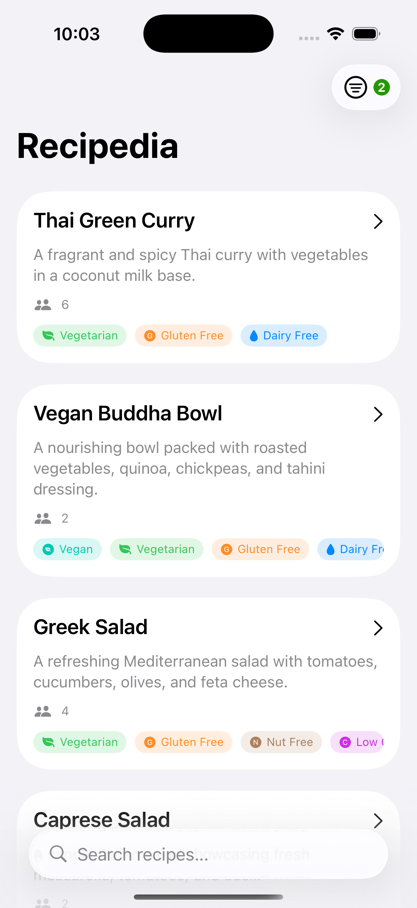
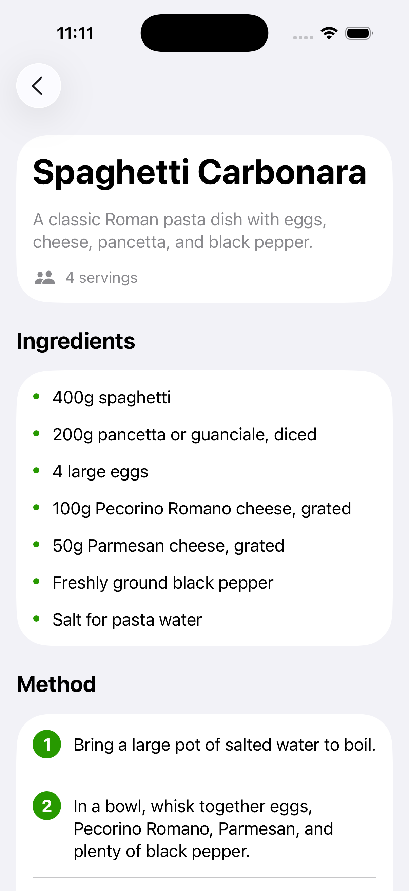

# Recipedia

SwiftUI recipe browser with search and filtering. Built as a mock API demo.




## Setup

```
open Recipedia.xcodeproj
there are no packages or special set up actions
# Build and run (⌘R)
```

**Requirements:** Xcode 15+, iOS 26.0+

## Architecture

Standard MVVM with a mock API layer:

- **Model:** `Recipe` struct with dietary attributes
- **Service:** `RecipeService` calls `MockRecipeAPI` (simulates backend with 500ms delay)
- **ViewModel:** `RecipeListViewModel` manages filter state and triggers searches
- **Views:** SwiftUI components (`RecipeListView`, `RecipeDetailView`, `FilterSheetView`)

Data flows from `MockRecipeAPI` → `RecipeService` → `RecipeListViewModel` → Views.

Mock API filters recipes server-side (simulated) using AND logic across all active filters. Filtering happens in `MockRecipeAPI.searchRecipes()` to mimic real backend behavior.

## Key Design Decisions

**Mock API pattern:** Filtering logic lives in `MockRecipeAPI` instead of the ViewModel. This simulates a real backend where the server handles search/filter queries. Makes it trivial to swap in a real API later—just change the implementation in `MockRecipeAPI`.

**@Observable macro:** Using iOS 17's `@Observable` instead of `ObservableObject`. Cleaner syntax, less boilerplate.

**Multi-select dietary filters:** Can filter by any combination of dietary attributes (vegan + gluten-free, etc). More flexible than single-select.

**Component-based views:** Small, reusable components (`RecipeCardView`, `DietaryTagBar`, `ErrorView`) for maintainability.

## Assumptions and Tradeoffs

**Assumptions:**
- Recipes stored in bundled JSON file (`recipes.json`)
- AND logic for multiple filters (recipes must match ALL active filters)
- Filtering happens server-side (even though it's mocked locally)

**Tradeoffs:**
- No persistence—filters reset on app restart
- No images—kept data simple
- No sorting options—displays in JSON order
- Ingredient matching is basic substring search, not smart parsing
- 500ms artificial delay in mock API (simulates network)

## Known Limitations

- iOS 17+ only (requires `@Observable` macro)
- Mock API filters everything in-memory (fine for 15 recipes, wouldn't scale)
- No pagination (loads all results at once)
- Filter UI doesn't show which specific filters are active, just a count
- Could probably do something smarter for ingredients - an object that contains an amount and an ingredient. This would open the door for measurement conversions

## Testing

The project includes SwiftUI Previews for rapid development and visual testing. To test:

1. **Preview in Xcode**: Use the preview canvas for individual views
2. **Search**: Type "chicken" or "pizza" in the search bar
3. **Dietary Filters**: Toggle multiple dietary attributes like "Vegetarian" and "Gluten Free"
4. **Servings**: Select different serving ranges
5. **Ingredients**: Try including "garlic, tomatoes" and excluding "meat"
6. **Navigation**: Tap recipe cards to view full details
