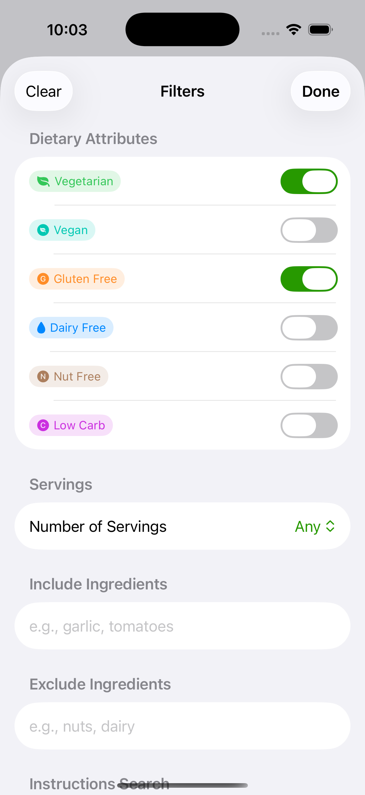

# Recipedia

SwiftUI recipe browser with search and filtering. Built as a mock API demo.

  

## Setup

```
1. open Recipedia.xcodeproj
2. there are no packages or special set up actions
3. build and run (cmd + R)
```

**Requirements:** Xcode 15+, iOS 26.0+

## Architecture

Pretty standard MVVM with a mock API layer:

- **Model:** `Recipe` struct with dietary attributes
- **Service:** `RecipeService` calls `MockRecipeAPI` (simulates backend with 500ms delay)
- **ViewModel:** `RecipeListViewModel` manages filter state and triggers searches
- **Views:** SwiftUI components (`RecipeListView`, `RecipeDetailView`, `FilterSheetView`)

Data flows from `MockRecipeAPI` → `RecipeService` → `RecipeListViewModel` → Views.

The mock API filters recipes "server-side". Filtering happens in `MockRecipeAPI.searchRecipes()` to mimic real backend behavior.

## Key Design Decisions

**Mock API pattern:** Filtering logic lives in `MockRecipeAPI` instead of the ViewModel. This simulates a real backend where the server handles search/filter queries. This way, it's trivial to swap in a real API later.

**@Observable macro:** Using iOS 17's `@Observable` instead of `ObservableObject`. Cleaner syntax and less boilerplate.

**Multi-select dietary filters:** Can filter by any combination of dietary attributes (vegan + gluten-free, etc). More flexible than single-select.

**Component-based views:** Small, reusable components (`RecipeCardView`, `DietaryTagBar`, `ErrorView`) for maintainability.

## Assumptions and Tradeoffs

**Assumptions:**
- Recipes stored in bundled JSON file (`recipes.json`)
- AND logic for multiple filters (recipes must match all active filters)
- Filtering happens server-side

**Tradeoffs:**
- No persistence - filters reset on app restart
- No images - kept data simple
- No sorting options - displays in JSON order
- Ingredient matching is a basic substring search
- 500ms artificial delay in mock API to simulate network delay

## Known Limitations

- Mock API filters everything in-memory (fine for 15 recipes, wouldn't scale)
- No pagination (loads all results at once)
- Filter button doesn't show which specific filters are active, just a count
- Could probably do something smarter for ingredients - an object that has an amount and an ingredient. This would open the door for measurement conversions
- Lack of testing - for production I would write full unit tests for the services and view models
